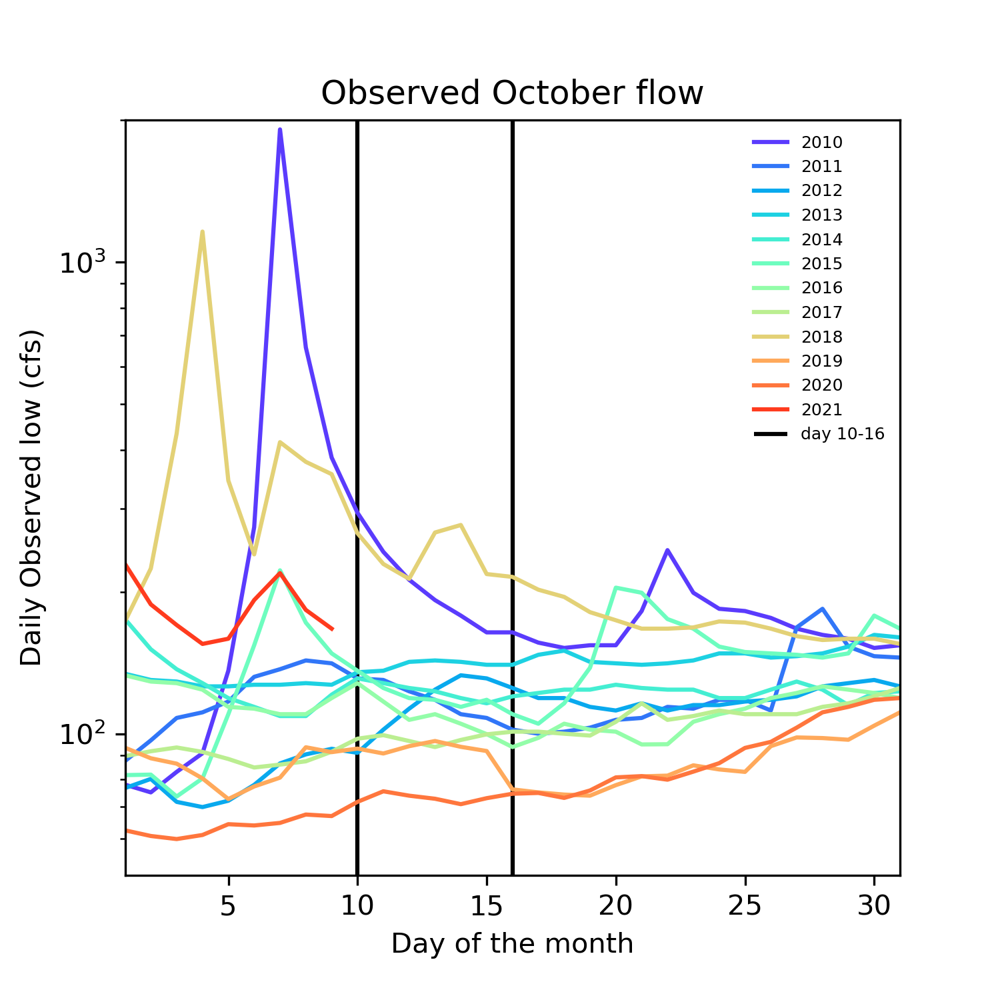
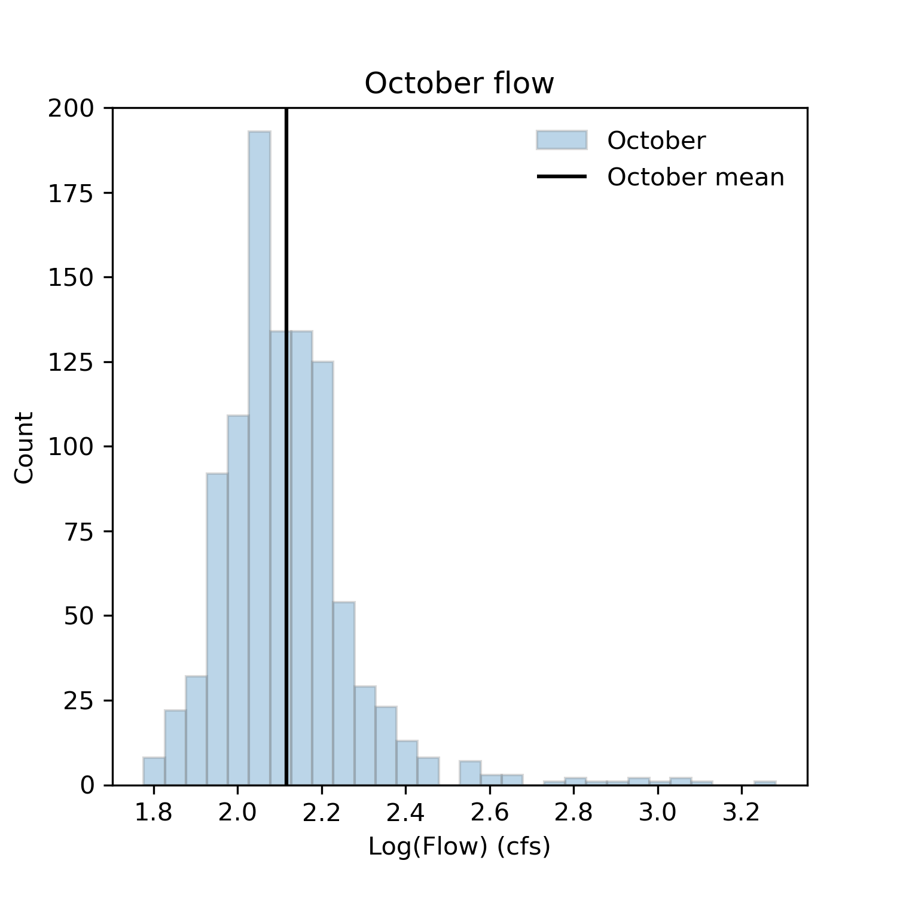
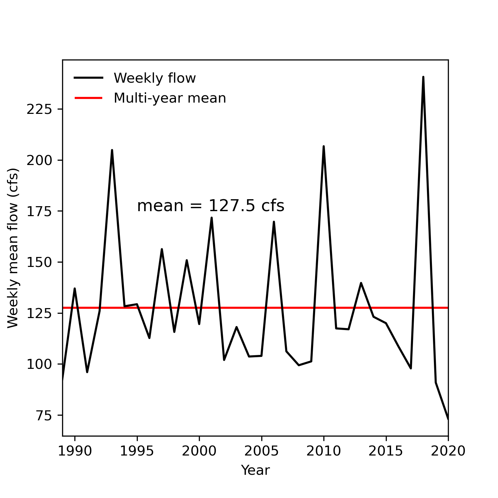

### Xueyan Zhang
### 10/10/2021
### Assignment 7

 

### Code instruction
- Just run the script because this is no need to revise streamflow data; however, some code may be not as efficient and effective as we expected. Therefore, please leave your revision or suggestions at the end of this file.
- You will see three plots generated after the run, which will be used in this markdown file.
- Go through the generated plots and have a sense of what the flow will be for next week (hint: we know the October mean and the evolution trend of October flow this year; then guess a value).
- Fill all blanks.
 

### Forecast
We generated three plots as follows:
- First plot: observed October flow during 2010-2021. Here we showed only flows after 2010 because climate change greatly affect streamflow
  
  
  
- Second plot: histogram of October flow during all past years with a mean of 130.7 cfs
  
- Third plot: Weekly mean flow (day 10-16) in October during 1989-2020. We can see increasing variabilities of weekly mean flow during day 10-16, especially after 2010, which supports our choice in the first plot.
  
- Therefore, we forecasted weekly mean for next week and two weeks laters should be () and () cfs, respectively. 
 

### Code revision or suggestion
- First, ()
- Second, ()
- Third, ()