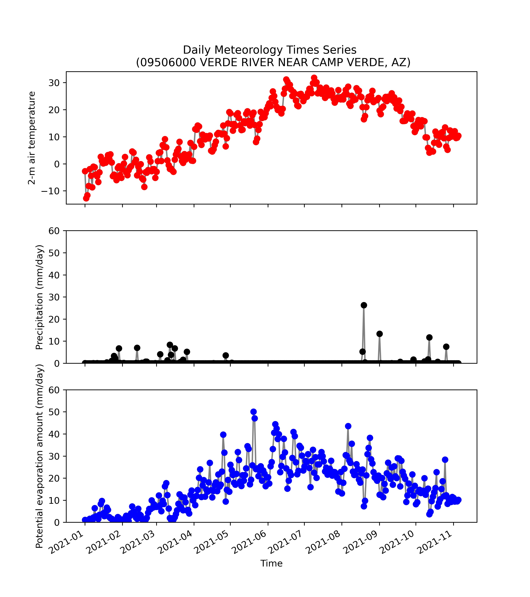

### Xueyan Zhang
### Assignment 11
### 11/7/2021

____
### Grade: 
3/3: Great work. I really like the datasets you added. 
____

1. A brief summary of the how you chose to generate your forecast this week.
    

   Similar to what I did last two weeks, I built a autoregressive linear model with predictors of flows during last week and two weeks ago. Also, I plotted time series of temperature, precipitation, and potential evaporation rate during 2021, which provided additional information of seasonal variaitons of climate forcing with me! Therefore, my forecast for this week is 120 cfs.

2. A description of the dataset you added
   
    * What is the dataset? Why did you choose it?
  
      NCEP Reanalysis daily averages was used in this forecast because it provides temperature, precipitation, and potential evaporation.

    * What is the spatial and temporal resolution and extent of the data ?
        
      global coverage; 2.5-degree; daily 

    * Where did you get the data from?
  
      https://psl.noaa.gov/cgi-bin/db_search/SearchMenus.pl

    * What was your approach to extracting and aggregating it into something useful to you?
  
      Because of the coarese spatial resolution, I only picked the nearset gridcell to our forecast gauge site. Precipitation is wat input into land surface, and potential evaporation represents the amount of water that may leave the land system. Therefore, time series of these two variables plus my linear regression model give me the forecast this week.

3. A plot of the dataset you added. This can be a timeseries, map, histogram or any other plot that you think is a good summary of what you added.
   
   