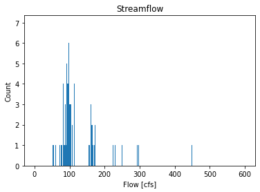

### Xueyan Zhang
### 19/09/2021
### Assignment 2

_________
## Grade: 
3/3: Great work!
A few notes for next time: 
- I'm not grading your python script for content yet but I still want to be able to easily see the answers to the questions. Make sure you organize around questions and get rid of the comments from the start code that are not relevant. 
- Great job getting images inserted into the markdown! I will also show another way to do this next week. 
- Make sure to name your pythohn code per the assignmen instructions
_________

### Questions
1. Provide a summary of the forecast values you picked and why. Include discussion of the quantitative analysis that lead to your prediction. This can include any analysis you complete but must include at least two histograms and some quantitative discussion of flow quantiles that helped you make your decision.

    First, I picked all flow values during the second half September, which produced a minimum of 51 cfs and mean of 166 cfs. The histogram of the picked flow is shown below with a unusal flow of 5590 excluded. In addition, the 10th and 50th percentile flow values are 76 cfs and 107 cfs. Because the aevraged daily flow during last week is ~90 cfs, I got the forecast value of 76 cfs and 60 cfs for week 1 and week 2.

1. Describe the variable flow_data:

   What is it?

   flow_data is a numpy array.

   What type of values is is composed of?

   float

   What is are its dimensions, and total size?

   It is a 2-d array with a total size of 47796.

2. How many times was the daily flow greater than your prediction in the month of September (express your answer in terms of the total number of times and as a percentage)?
   
   121; 39.1%

3. How would your answer to the previous question change if you considered only daily flows in or before 2000? Same question for the flows in or after the year 2010? (again report total number of times and percentage)

    before 2000: 7; 2.1%

    after 2010: 63; 19.8%

4. How does the daily flow generally change from the first half of September to the second?

     The daily flows during the first and second half September are 176.6 cfs and 166.0 cfs, respectively, reflecting the declining flow pattern during September. 

