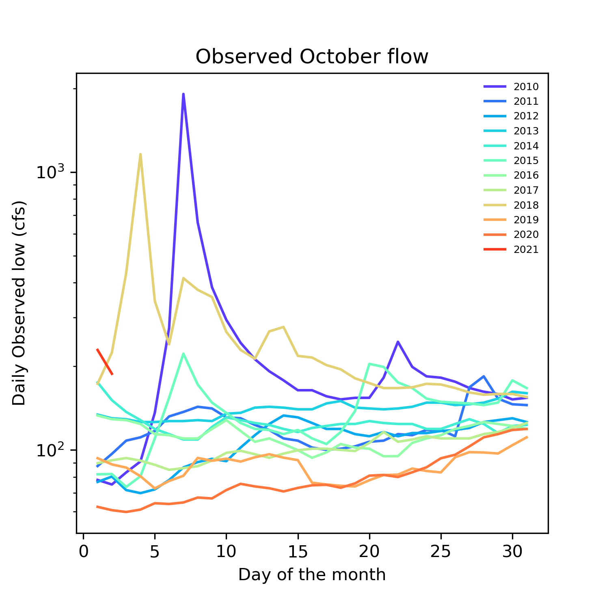

### Xueyan Zhang
### 10/03/2021
### Assignment 6
 
_____
### Grade
3/3: Great job! I love what you did with the plots. Nice work with the shading and the filled line plots they all came out really great. 
___

### Summary and supporting plots
Given September flow values and October flow distribtuion, I predicted flows during next week and two weeks later are 150 cfs and 100 cfs, respectively.
 
1. Time series plot of observed daily flow during 1989-2021
     

2. Boxplot of daily observed flow before and after 2000: we see the distribution of October flow changes during these two periods. 
   

3. Observed October flows during 1989-2021: We can see October flow in 2021 starts really high compared to other years with a decreasing trend.
     

4. The comparison of September flow between 2020 and 2021 gave me how the flow actually changes in this year.
    

5. The comparison of September and October flow distribution suggests October flow has a narrow distribution but higher median compared to September flow.
    

6. Two histograms of October and November flow have values concentrating within 100-300 cfs.
    
