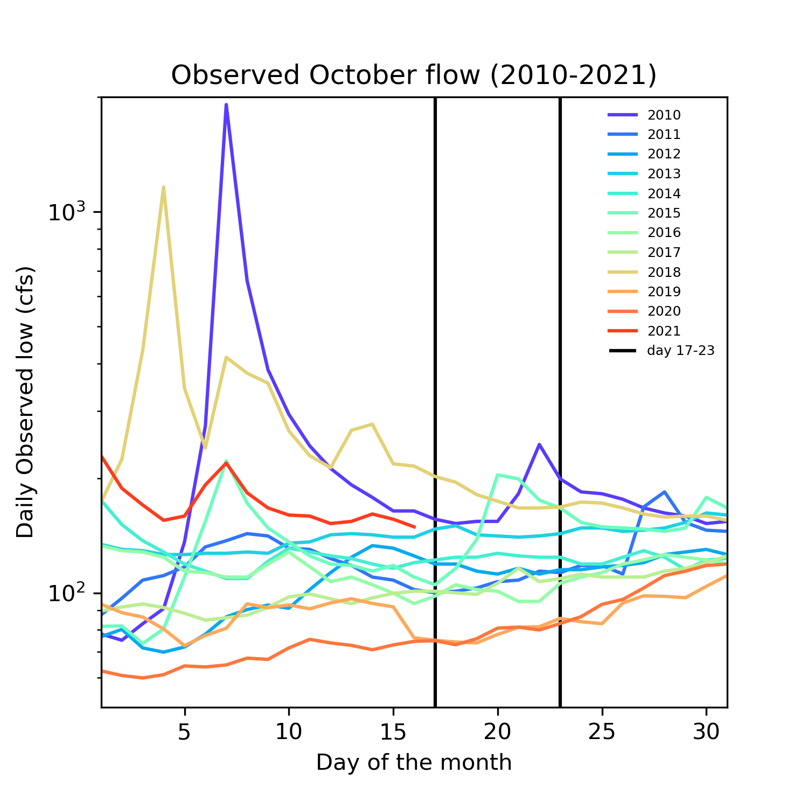
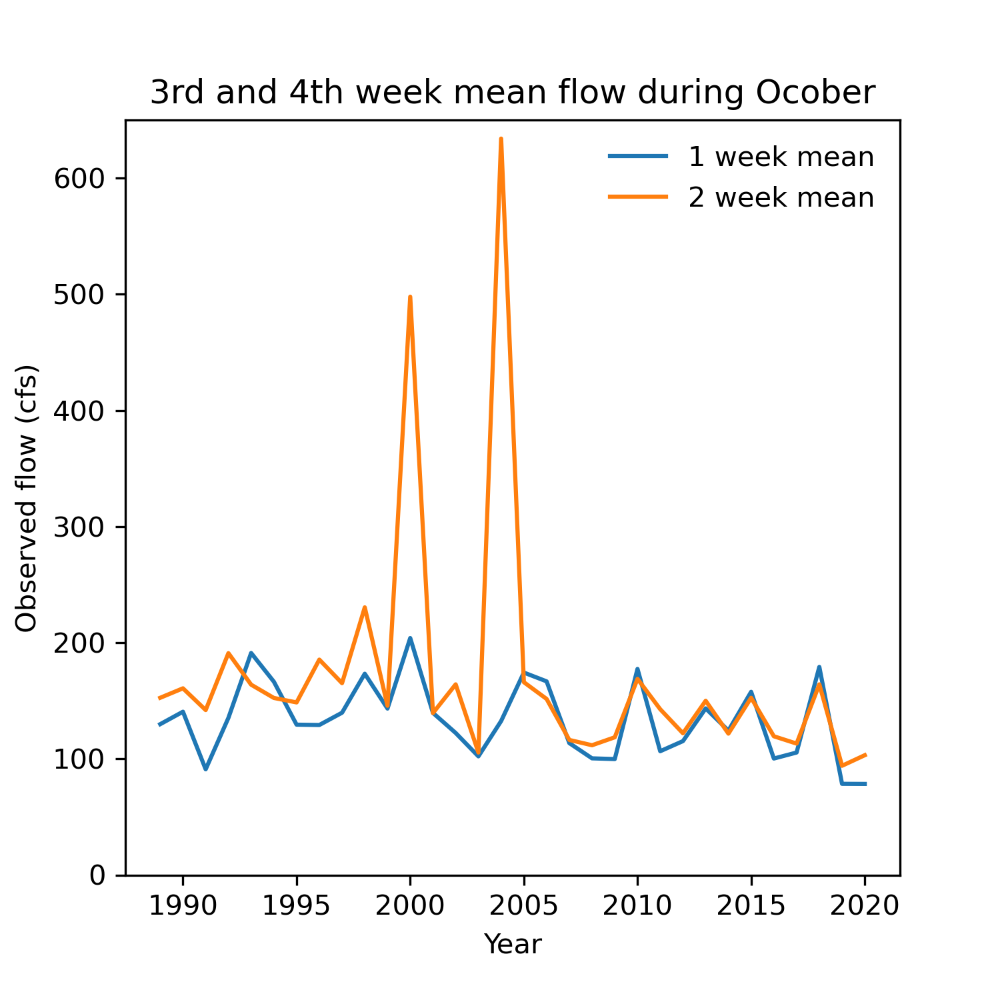
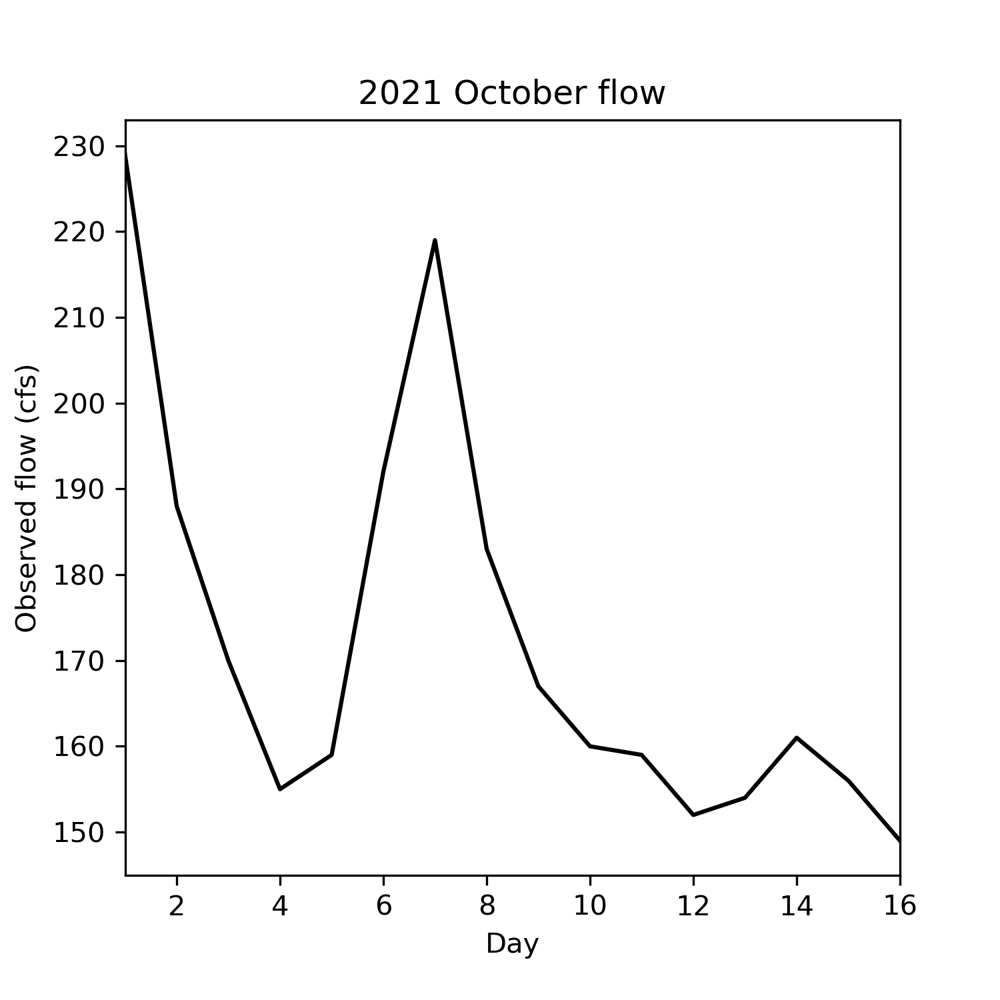

### Xueyan Zhang
### 10/10/2021
### Assignment 8

____________
## Grade:
### 1. Forecast Submision: 
**3/3:** Great work I love your plots! I'm glad you got some good comments from the peer review and I really like your data downloading approach. You will be ahead of the game when we talk about that this week. 

### 2. Graded Script
Refer to [the rubric](https://github.com/HAS-Tools-Fall2021/Course-Materials21/blob/main/Content/Starter_Codes/week7_code_review_rubric.md) for details on scoring: 
- **Readability:2.5/3** Great job with the commenting and the doc strings, overall very easy to follow. I just subtracted 0.5 because you need to include the data types in the docstrings for the input and output variables. 
- **Style:3/3** no pep8 errors
- **Code:3/3** Well done, I was able to run it with no issues.  One comment on your function. Note that using what we learned about time series last week, you can do tihs weekly averaging automatically without a for loop. 
____________

### Forecast
We generated three plots as follows:
- The first plot shows observed October flow during 2010-2021. We can get a basic understanding of how October flow changes.

- The second plot shows 3rd and 4th week mean flow during October of all pas years. We see a general decresing pattern with time. Based on those two time series, we derived mean and median for the forecast weeks. 

- Last plot shows 2021 October flow because it is implicitly represent previous land surface conditions, such as soil moisture. Therefore, I took mean of the current October daily flow as a controling factor in my forecast prediction.
  

  
- Therefore, we forecasted weekly mean for next week and two weeks laters should be 121 and 144 cfs, respectively. 
 

### Brief summary of the peer evaluation

The suggestion from Xingyu and script evaluation for Xiang greatly enhanced my understanding of script writing. First, programming script has to be clear with comments for each step. Second, a reasonable code blocking can be useful to track the idea and steps behind the script. Third, we need to keep our scripts simple but without losing the necessary information.

### A summary of how you are using time series functionality in your script.

I used the time series functionality to extract days and years as my plot x axis values. I also used this funcionality as a criterion to select data.

### Describe the part of your script that you are mos proud of and why

I used a python package to download the flow data from USGS website, which is automatically save as a pandas dataframe with datetime as my row index. The best thing is that I do not need to visit the website and repeat the downloading job again!

